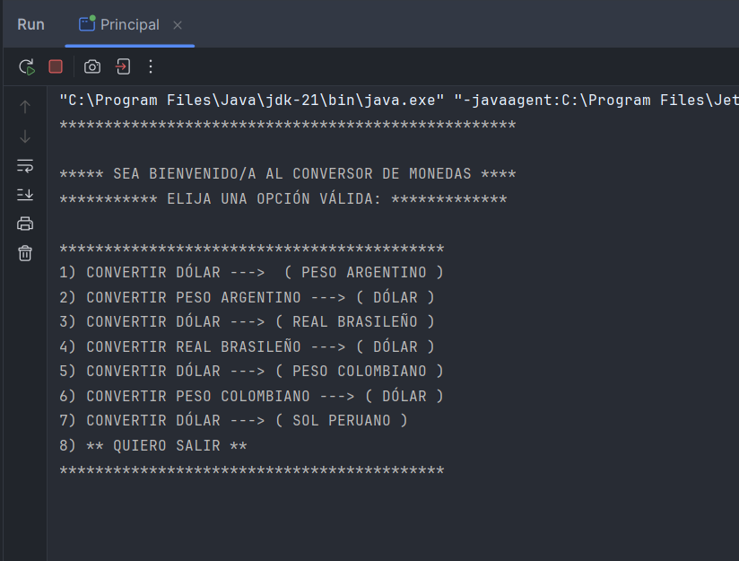
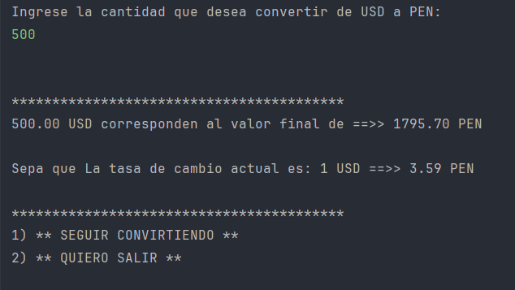

# 💱 Conversor de Monedas en Java

Este proyecto es un conversor de monedas desarrollado en Java. Utiliza una API externa para obtener tasas de cambio en tiempo real, permitiendo convertir montos de una divisa a otra directamente desde la consola.

---

## 🚀 Tecnologías Utilizadas

- **Java 17**
- **Maven**
- **ExchangeRate-API** (https://www.exchangerate-api.com/)

---

## 🧩 Estructura del Proyecto

---

## ⚙️ ¿Cómo funciona?

El programa:

1. Muestra un menú al usuario.
2. Solicita el monto en dólares.

3. Usa la clase `ApiClient` para consultar el tipo de cambio.
4. Muestra el resultado convertido en pantalla.

## ▶️ Ejecución

1. Abre el proyecto en IntelliJ IDEA.
2. Asegúrate de tener Java y Maven configurados correctamente.
3. Ejecuta `Principal.java`.

## 🔐 Clave API

El proyecto usa una clave API para conectarse al servicio de tipo de cambio.
- **ExchangeRate-API** (https://www.exchangerate-api.com/)

---

## 📞 Contacto

Autor: Jonas Rivadeneyra Aznaran  
Correo: [aznaranjonas@gmail.com]
Celular: +51907094805

---
